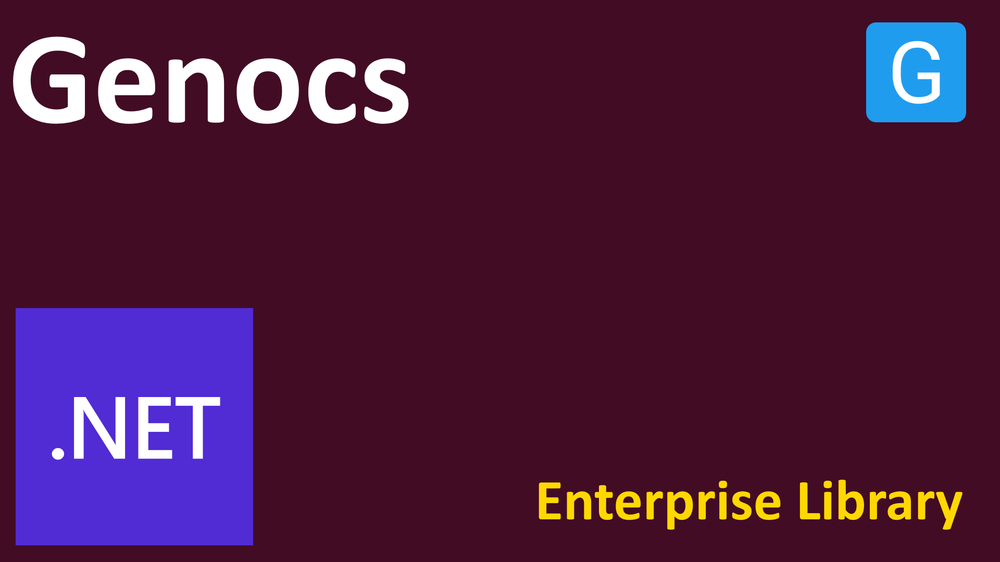

<!-- PROJECT SHIELDS -->
[![License][license-shield]][license-url]
[![Build][build-shield]][build-url]
[![Downloads][downloads-shield]][downloads-url]
[![Contributors][contributors-shield]][contributors-url]
[![Forks][forks-shield]][forks-url]
[![Stargazers][stars-shield]][stars-url]
[![Issues][issues-shield]][issues-url]
[![Discord][discord-shield]][discord-url]
[![Gitter][gitter-shield]][gitter-url]
[![Twitter][twitter-shield]][twitter-url]
[![Twitterx][twitterx-shield]][twitterx-url]
[![LinkedIn][linkedin-shield]][linkedin-url]

[license-shield]: https://img.shields.io/github/license/Genocs/microservice-template?color=2da44e&style=flat-square
[license-url]: https://github.com/Genocs/microservice-template/blob/main/LICENSE
[build-shield]: https://github.com/Genocs/microservice-template/actions/workflows/build_and_test.yml/badge.svg?branch=main
[build-url]: https://github.com/Genocs/microservice-template/actions/workflows/build_and_test.yml
[downloads-shield]: https://img.shields.io/nuget/dt/Genocs.Microservice.Template.svg?color=2da44e&label=downloads&logo=nuget
[downloads-url]: https://www.nuget.org/packages/Genocs.Microservice.Template
[contributors-shield]: https://img.shields.io/github/contributors/Genocs/microservice-template.svg?style=flat-square
[contributors-url]: https://github.com/Genocs/microservice-template/graphs/contributors
[forks-shield]: https://img.shields.io/github/forks/Genocs/microservice-template?style=flat-square
[forks-url]: https://github.com/Genocs/microservice-template/network/members
[stars-shield]: https://img.shields.io/github/stars/Genocs/microservice-template.svg?style=flat-square
[stars-url]: https://img.shields.io/github/stars/Genocs/microservice-template?style=flat-square
[issues-shield]: https://img.shields.io/github/issues/Genocs/microservice-template?style=flat-square
[issues-url]: https://github.com/Genocs/microservice-template/issues
[discord-shield]: https://img.shields.io/discord/1106846706512953385?color=%237289da&label=Discord&logo=discord&logoColor=%237289da&style=flat-square
[discord-url]: https://discord.com/invite/fWwArnkV
[gitter-shield]: https://img.shields.io/badge/chat-on%20gitter-blue.svg
[gitter-url]: https://gitter.im/genocs/
[twitter-shield]: https://img.shields.io/twitter/follow/genocs?color=1DA1F2&label=Twitter&logo=Twitter&style=flat-square
[twitter-url]: https://twitter.com/genocs
[linkedin-shield]: https://img.shields.io/badge/-LinkedIn-black.svg?style=flat-square&logo=linkedin&colorB=555
[linkedin-url]: https://www.linkedin.com/in/giovanni-emanuele-nocco-b31a5169/
[twitterx-shield]: https://img.shields.io/twitter/url/https/twitter.com/genocs.svg?style=social
[twitterx-url]: https://twitter.com/genocs


<p align="center">
    
</p>


# Genocs .NET Web API Microservice Template

This repo contains a set of libraries designed by Genocs. The library is built on top of .NET9. 

Packages are available on [NuGet Genocs](https://www.nuget.org/profiles/gioema_nocco).

## The idea

***Build a software library to be cloud agnostic***

Building a software library to be cloud agnostic has several advantages. First, it allows developers to create applications that can be deployed on any cloud platform without having to rewrite code or make major changes. This makes it easier for developers to quickly deploy their applications across multiple cloud providers. Additionally, it reduces the cost of development and maintenance since developers don’t have to write separate code for each cloud provider. Finally, it increases the scalability of applications since they can be easily deployed on different cloud platforms with minimal effort. 

***Cloud agnostic by use of Containers***

The advantages of using containers are numerous. Containers provide a lightweight, portable, and isolated environment for applications to run in, allowing them to be easily moved between different systems. This makes it easier to deploy applications quickly and reliably across different environments. Additionally, containers can help reduce resource consumption by running multiple applications on the same host, as each container is isolated from the others. This helps to improve efficiency and scalability. Finally, containers provide an additional layer of security, as they are isolated from the underlying operating system and other applications.

## **Libraries**

You can find a full documentation on:
[**Documentation**](https://genocs-blog.netlify.app/library/)


## Support

Use [**api-workbench**](./api-workbench.rest) inside Visual Studio code with [REST Client](https://marketplace.visualstudio.com/items?itemName=humao.rest-client) plugin 


---

## Build Solution

Following are the step to build the solution.
``` bash
# Build the solution 
dotnet build

# Run project with console
dotnet run --project ./src/WebApi
```

### How to build Docker image

``` bash
# Build webapi
docker build -t genocs/genocs.microservice.template-webapi:2.0.0 -t genocs/genocs.microservice.template-webapi:latest -f ./dockerfile .

# Push on Dockerhub
docker push genocs/genocs.microservice.template-webapi:2.0.0
docker push genocs/genocs.microservice.template-webapi:latest
```
---


## Working with Docker-Compose

There are some prerequisites for using the included docker-compose.yml files:

1. Make sure you have docker installed (on windows install docker desktop)
2. Create and install an https certificate:

    ```bash
    dotnet dev-certs https -ep $env:USERPROFILE\.aspnet\https\cert.pfx -p password!
    ```

3. It's possible that the above step gives you an `A valid HTTPS certificate is already present` error.
   In that case you will have to run the following command, and then  `Re-Run Step 2`

    ```bash
     dotnet dev-certs https --clean
    ```

4. Trust the certificate

    ```bash
     dotnet dev-certs https --trust
    ```


## Docker-Compose Commands

Genocs Microservice .NET WebAPI Template includes 3 Docker-Compose Files!
- WebAPI + MSSQL (default)
- WebAPI + PostgreSQL
- WebAPI + MYSQL

1) WebAPI + MSSQL (default)
```bash
# Build with docker compose
docker compose -f ./docker-compose.mssql.yml -f ./docker-compose.override.yml --env-file ./local.env --project-name genocs-app build

# Run with docker compose
docker compose -f ./docker-compose.mssql.yml -f ./docker-compose.override.yml --env-file ./local.env --project-name genocs-app up -d

# Stop and remove containers
docker-compose -f docker-compose.mssql.yml down

# Clean Docker cache
docker builder prune
```

2) WebAPI + PostgreSQL 
```bash
# Build with docker compose
docker compose -f ./docker-compose.postgresql.yml -f ./docker-compose.override.yml --env-file ./local.env --project-name genocs-app build

# Run with docker compose
docker compose -f ./docker-compose.postgresql.yml -f ./docker-compose.override.yml --env-file ./local.env --project-name genocs-app up -d

# Stop and remove containers
docker-compose -f docker-compose.postgresql.yml down

# Clean Docker cache
docker builder prune
```


3) WebAPI + MYSQL
```bash
# Build with docker compose
docker compose -f ./docker-compose.mysql.yml -f ./docker-compose.override.yml --env-file ./local.env --project-name genocs-app build

# Run with docker compose
docker compose -f ./docker-compose.mysql.yml -f ./docker-compose.override.yml --env-file ./local.env --project-name genocs-app up -d

# Stop and remove containers
docker-compose -f docker-compose.mysql.yml down

# Clean Docker cache
docker builder prune
```

Your API should be available at [`http://localhost:5100/swagger`](https://localhost:5100/swagger) and [`https://localhost:5101/swagger`](http://localhost:5010/swagger)

## Specifications

Let's first examine the Environment Variables passed into the dotnet-webapi container.

- `ASPNETCORE_ENVIRONMENT` : Custom Environment Name.
- `ASPNETCORE_URLS` : Enter in the Port list.
- `ASPNETCORE_HTTPS_PORT` : Custom SSL Port.
- `DatabaseSettings__ConnectionString` : Valid Connection String.
- `HangfireSettings__Storage__ConnectionString` : Valid Connection String.
- `DatabaseSettings__DBProvider` : This will the database engine.
- `HangfireSettings__Storage__StorageProvider` : This will the database engine.

Each of the docker-compose will have the same exact variables with values suited to the context.

Note that the default Docker Image that will be pulled is `genocs/dotnet-webapi:latest`. This is my public Image Repository.


The script below allows to setup the infrastructure components. This means that you can find all the containers inside the same network.

The network is called `genocs`.

``` yml 
networks:
  genocs:
    name: genocs-network
    driver: bridge
```

Remember to add the network configuration inside your docker compose file to setup the network, before running the containers.


## ***Kubernetes cluster***

You can setup the application inside a Kubernetes cluster.

Check the repo [enterprise-containers](https://github.com/Genocs/enterprise-containers) to setup a Kubernetes cluster. 
There you can find scripts, configuration files and documentation to setup a cluster from scratch.

### Deploy in a cloud instance

You can deploy Demo Application with one click in Heroku, Microsoft Azure, or Google Cloud Platform: 

[](https://heroku.com/deploy?template=https://github.com/heartexlabs/label-studio/tree/heroku-persistent-pg)
[](https://portal.azure.com/#create/Microsoft.Template/uri/https%3A%2F%2Fraw.githubusercontent.com%2Fheartexlabs%2Flabel-studio%2Fmaster%2Fazuredeploy.json)
[](https://deploy.cloud.run)

## License

This project is licensed with the [MIT license](LICENSE).


## Community

- Discord [@genocs](https://discord.com/invite/fWwArnkV)
- Facebook Page [@genocs](https://facebook.com/Genocs)
- Youtube Channel [@genocs](https://youtube.com/c/genocs)


## Support

Has this Project helped you learn something New? or Helped you at work?

Here are a few ways by which you can support.

- ⭐ Leave a star!
- 🥇 Recommend this project to your colleagues.
- 🦸 Do consider endorsing me on LinkedIn for ASP.NET Core - [Connect via LinkedIn](https://www.linkedin.com/in/giovanni-emanuele-nocco-b31a5169/)
- ☕ If you want to support this project in the long run, consider [buying me a coffee](https://www.buymeacoffee.com/genocs)!


[](https://www.buymeacoffee.com/genocs)

## Code Contributors

This project exists thanks to all the people who contribute. [Submit your PR and join the team!](CONTRIBUTING.md)

[](https://github.com/Genocs/microservice-template/graphs/contributors)

## Financial Contributors

Become a financial contributor and help me sustain the project.

**Support the Project** on [Opencollective](https://opencollective.com/genocs)

## Acknowledgements

- [Mukesh Murugan](https://github.com/iammukeshm)
- [FullStackHero](https://fullstackhero.net)
